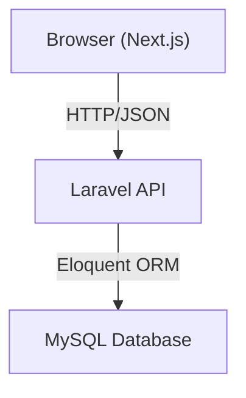

# Design Document

## Overview

The job vacancy system is a two-tier web application for the Dicoding Jobs platform. A Laravel (PHP) backend exposes a RESTful JSON API; a Next.js frontend consumes that API to let recruiters post vacancies and job seekers browse, search, and view them.

The backend is the single source of truth for all vacancy data. The frontend is a thin client that delegates all persistence and search logic to the API. Communication between the two tiers is exclusively over HTTP/JSON.

---

## Architecture



### Request Flow

1. Next.js page/component triggers a fetch (via TanStack Query).
2. Laravel routes the request to the appropriate controller.
3. The controller validates input (Form Request), queries the database via Eloquent, and returns a JSON response.
4. Next.js renders the response using reusable components (e.g. `JobCard`).

### Key Design Decisions

- **Stateless API**: No session state; every request is self-contained. This keeps the API horizontally scalable and easy to test.
- **TanStack Query on the frontend**: Provides caching, background refetching, and loading/error states without manual state management.
- **Laravel Form Requests**: Validation logic is isolated from controllers, making it independently unit-testable.
- **Soft-delete vs hard-delete**: The optional delete endpoint uses hard delete (simple scope for an MVP); soft delete can be added later without breaking the API contract.

---

## Components and Interfaces

### Backend (Laravel)

#### Routes

| Method | URI | Controller Method | Description |
|--------|-----|-------------------|-------------|
| POST | `/api/vacancies` | `VacancyController@store` | Create vacancy |
| GET | `/api/vacancies` | `VacancyController@index` | List / search vacancies |
| GET | `/api/vacancies/{id}` | `VacancyController@show` | Vacancy detail |
| PUT/PATCH | `/api/vacancies/{id}` | `VacancyController@update` | Update vacancy (optional) |
| DELETE | `/api/vacancies/{id}` | `VacancyController@destroy` | Delete vacancy (optional) |

Search is performed via the `title` query parameter on the list endpoint:
`GET /api/vacancies?title=engineer`

#### VacancyController

```
store(StoreVacancyRequest $request): JsonResponse   // 201 | 422
index(Request $request): JsonResponse               // 200
show(int $id): JsonResponse                         // 200 | 404
update(UpdateVacancyRequest $request, int $id): JsonResponse  // 200 | 404 | 422
destroy(int $id): JsonResponse                      // 204 | 404
```

#### StoreVacancyRequest / UpdateVacancyRequest

Encapsulate validation rules. `StoreVacancyRequest` requires all mandatory fields; `UpdateVacancyRequest` makes them optional (PATCH semantics).

#### Vacancy Model (Eloquent)

Wraps the `vacancies` table. Defines `$fillable`, casts, and any scopes (e.g. `scopeByTitle`).

### Frontend (Next.js)

#### Pages

| Route | Component | Description |
|-------|-----------|-------------|
| `/` or `/vacancies` | `VacanciesPage` | Lists all vacancies, hosts search input |
| `/vacancies/[id]` | `VacancyDetailPage` | Full detail for a single vacancy |

#### Components

- **`JobCard`**: Reusable card displaying vacancy summary (title, company, location). Accepts a `Vacancy` prop.
- **`SearchInput`**: Controlled input that updates a query state consumed by TanStack Query.

#### API Client (`lib/api.ts`)

Thin wrapper around `fetch` (or `axios`) that constructs URLs and handles JSON parsing. Functions:

```ts
getVacancies(title?: string): Promise<Vacancy[]>
getVacancy(id: number): Promise<Vacancy>
createVacancy(data: CreateVacancyPayload): Promise<Vacancy>
```

#### TanStack Query Hooks

- `useVacancies(title?: string)` — calls `getVacancies`, re-fetches when `title` changes.
- `useVacancy(id: number)` — calls `getVacancy`.

---

## Data Models

### Database Table: `vacancies`

| Column | Type | Constraints | Notes |
|--------|------|-------------|-------|
| `id` | BIGINT UNSIGNED | PK, AUTO_INCREMENT | Vacancy_ID |
| `title` | VARCHAR(255) | NOT NULL | Max 255 chars |
| `description` | TEXT | NOT NULL | Full job description |
| `company` | VARCHAR(255) | NOT NULL | Company name |
| `location` | VARCHAR(255) | NOT NULL | City / remote |
| `salary_range` | VARCHAR(100) | NULLABLE | e.g. "5,000,000 – 8,000,000 IDR" |
| `created_at` | TIMESTAMP | NOT NULL | Auto-managed by Laravel |
| `updated_at` | TIMESTAMP | NOT NULL | Auto-managed by Laravel |

### JSON Serialization Format

All API responses serialize a vacancy as:

```json
{
  "id": 1,
  "title": "Backend Engineer",
  "description": "...",
  "company": "Dicoding",
  "location": "Bandung",
  "salary_range": null,
  "created_at": "2024-01-15T08:00:00.000000Z",
  "updated_at": "2024-01-15T08:00:00.000000Z"
}
```

List responses wrap the array directly (no pagination envelope for MVP):

```json
[{ ... }, { ... }]
```

### TypeScript Interface (Frontend)

```ts
interface Vacancy {
  id: number;
  title: string;
  description: string;
  company: string;
  location: string;
  salary_range: string | null;
  created_at: string;
  updated_at: string;
}

interface CreateVacancyPayload {
  title: string;
  description: string;
  company: string;
  location: string;
  salary_range?: string | null;
}
```


---

## Correctness Properties

*A property is a characteristic or behavior that should hold true across all valid executions of a system — essentially, a formal statement about what the system should do. Properties serve as the bridge between human-readable specifications and machine-verifiable correctness guarantees.*

### Property 1: Valid create stores and returns submitted fields

*For any* valid vacancy payload (non-empty title ≤ 255 chars, non-empty description, company, and location), POSTing to `/api/vacancies` must return HTTP 201 and a response body whose fields match the submitted values.

**Validates: Requirements 1.1**

---

### Property 2: Invalid input is rejected with 422

*For any* POST payload that is missing at least one required field, or whose title exceeds 255 characters, the API must return HTTP 422 with a validation error body.

**Validates: Requirements 1.2, 1.3**

---

### Property 3: All created vacancy IDs are unique

*For any* sequence of N successful create requests, the N returned `id` values must all be distinct.

**Validates: Requirements 1.4**

---

### Property 4: List endpoint returns all stored vacancies

*For any* set of vacancies in the database (including the empty set), a GET to `/api/vacancies` must return HTTP 200 and a JSON array whose length equals the number of stored vacancies.

**Validates: Requirements 2.1, 2.2**

---

### Property 5: Frontend renders one JobCard per vacancy

*For any* list of vacancies returned by the API, the vacancies list page must render exactly that many `JobCard` elements.

**Validates: Requirements 2.3**

---

### Property 6: Search filter correctness

*For any* non-empty search term and any set of vacancies, a GET to `/api/vacancies?title={term}` must return HTTP 200 and only vacancies whose titles contain the search term (case-insensitive). Vacancies whose titles do not contain the term must not appear in the response.

**Validates: Requirements 3.1, 3.2**

---

### Property 7: Frontend search input filters displayed JobCards

*For any* search term entered in the frontend search input, only `JobCard` elements whose titles contain the term (case-insensitive) should be visible in the DOM.

**Validates: Requirements 3.3**

---

### Property 8: Serialization round-trip (POST → GET)

*For any* valid vacancy payload, creating it via POST and then fetching the created vacancy by its returned `id` via GET must produce a response whose `title`, `description`, `company`, `location`, and `salary_range` fields are equal to the originally submitted values.

**Validates: Requirements 4.1, 10.1, 10.2**

---

### Property 9: Non-existent Vacancy_ID returns 404

*For any* integer ID that does not correspond to an existing vacancy, GET `/api/vacancies/{id}`, PUT `/api/vacancies/{id}`, and DELETE `/api/vacancies/{id}` must all return HTTP 404.

**Validates: Requirements 4.2, 5.2, 6.2**

---

### Property 10 (Optional): Update round-trip

*For any* existing vacancy and any valid update payload, sending PUT/PATCH to `/api/vacancies/{id}` must return HTTP 200 and a response body whose updated fields match the submitted values.

**Validates: Requirements 5.1**

---

### Property 11 (Optional): Delete removes vacancy

*For any* existing vacancy, sending DELETE to `/api/vacancies/{id}` must return HTTP 204, and a subsequent GET to `/api/vacancies/{id}` must return HTTP 404.

**Validates: Requirements 6.1**

---

## Error Handling

### Backend

| Scenario | HTTP Status | Response Body |
|----------|-------------|---------------|
| Validation failure | 422 | `{ "message": "...", "errors": { "field": ["..."] } }` |
| Resource not found | 404 | `{ "message": "Vacancy not found." }` |
| Server error | 500 | `{ "message": "Server Error." }` |

- Laravel's `Handler` class is configured to return JSON for all API routes (via `$request->expectsJson()` or a dedicated API prefix).
- `ModelNotFoundException` is caught and mapped to 404 automatically via `Route::model` binding or explicit `findOrFail`.
- Validation errors from Form Requests are automatically returned as 422 by Laravel.

### Frontend

- TanStack Query exposes `isLoading`, `isError`, and `error` states; components render appropriate loading skeletons and error messages.
- Network errors (fetch failures) surface a user-friendly "Could not load vacancies" message.
- 404 on the detail page redirects to a "Vacancy not found" page using Next.js `notFound()`.

---

## Testing Strategy

### Dual Testing Approach

Both unit/integration tests and property-based tests are required. They are complementary:

- **Unit / integration tests** catch concrete bugs with specific examples and verify integration points.
- **Property-based tests** verify universal correctness across a wide range of generated inputs.

### Backend — Laravel (PHP)

**Unit Tests** (`tests/Unit/`)

- `VacancyModelTest`: verify `$fillable` fields, attribute casting, and `scopeByTitle` filter logic.
- `StoreVacancyRequestTest`: verify validation rules accept valid payloads and reject invalid ones (missing fields, title > 255).

**Integration Tests** (`tests/Feature/`)

- `CreateVacancyTest`: POST valid data → 201 + body; POST invalid data → 422.
- `ListVacanciesTest`: seed N vacancies → GET returns N items; empty DB → empty array.
- `SearchVacanciesTest`: seed mixed vacancies → GET with `?title=` returns only matches.
- `VacancyDetailTest`: GET existing ID → 200 + correct body; GET non-existent ID → 404.
- `UpdateVacancyTest` (optional): PUT valid → 200; PUT non-existent → 404; PUT invalid → 422.
- `DeleteVacancyTest` (optional): DELETE existing → 204; DELETE non-existent → 404.

**Property-Based Tests** — use [**Eris**](https://github.com/giorgiosironi/eris) (PHP property-based testing library).

Each property test runs a minimum of **100 iterations**.

| Test | Design Property | Tag |
|------|----------------|-----|
| Random valid payloads → 201 + matching fields | Property 1 | `Feature: job-vacancy-system, Property 1: Valid create stores and returns submitted fields` |
| Random invalid payloads → 422 | Property 2 | `Feature: job-vacancy-system, Property 2: Invalid input is rejected with 422` |
| N sequential creates → all IDs unique | Property 3 | `Feature: job-vacancy-system, Property 3: All created vacancy IDs are unique` |
| Seed N vacancies → list returns N | Property 4 | `Feature: job-vacancy-system, Property 4: List endpoint returns all stored vacancies` |
| Random search term → only matching titles returned | Property 6 | `Feature: job-vacancy-system, Property 6: Search filter correctness` |
| POST then GET → equivalent fields | Property 8 | `Feature: job-vacancy-system, Property 8: Serialization round-trip` |
| Random non-existent IDs → 404 | Property 9 | `Feature: job-vacancy-system, Property 9: Non-existent Vacancy_ID returns 404` |
| Random update payload → 200 + updated fields (optional) | Property 10 | `Feature: job-vacancy-system, Property 10: Update round-trip` |
| Delete then GET → 404 (optional) | Property 11 | `Feature: job-vacancy-system, Property 11: Delete removes vacancy` |

### Frontend — Next.js

**Component Tests** (Jest + React Testing Library)

- `JobCard`: renders title, company, location from props.
- `SearchInput`: onChange updates query state.
- `VacanciesPage`: mocked `useVacancies` hook → correct number of `JobCard` elements rendered (Property 5).
- `VacanciesPage` with search: mocked hook with filtered data → only matching cards visible (Property 7).

**End-to-End Tests** (Playwright)

Run against a live instance of both the API and frontend.

| Test | Design Property / Requirement |
|------|-------------------------------|
| Open list page → at least one `JobCard` visible | Requirement 9.1 |
| Type search term → only matching `JobCard`s visible | Requirement 9.2 / Property 7 |
| Click vacancy → detail page shows correct fields | Requirement 9.3 / Property 8 |

Each Playwright test is tagged with the corresponding property or requirement reference in a comment at the top of the test block.

### Test Configuration Notes

- Backend tests use an in-memory SQLite database (`:memory:`) via `RefreshDatabase` trait to keep tests fast and isolated.
- Playwright tests require `NEXT_PUBLIC_API_URL` pointing to a running Laravel dev server.
- Property-based tests are configured with `->withMaxSize(100)` (Eris) to generate sufficiently varied inputs.
